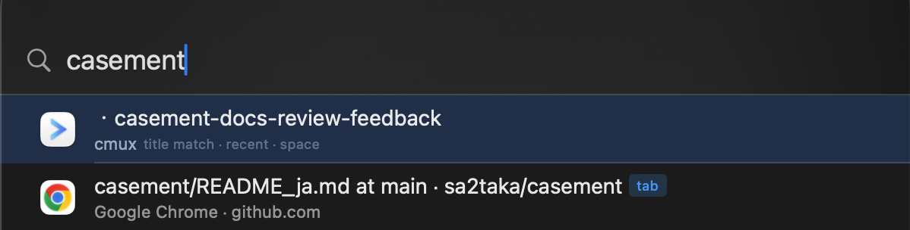

# Casement

macOS 向けの高速キーボード駆動ウィンドウスイッチャー。

Casement は、開いている全てのウィンドウをアプリ名やタイトルで検索し、数キーストロークで即座にフォーカスを切り替えます。ウィンドウ版の Spotlight です。



## 機能

- **グローバルホットキー** --- `Option+Space`（設定可能） でどこからでも検索パネルを起動
- **あいまい検索** --- アプリ名、タイトル、頭文字（アクロニム）、部分一致で検索
- **Chrome タブ検索** --- Chrome のタブをタイトルや URL ドメインで検索・切替
- **Cmux ワークスペース検索** --- Cmux のワークスペースを検索・切替
- **アプリ除外** --- Preferences またはインラインアクションでノイズアプリを除外

## 要件

- macOS 14.0 (Sonoma) 以降
- **Accessibility 権限**（ウィンドウ列挙とフォーカス切替に必須）
- **Automation 権限**（Chrome タブ検索用、初回使用時に macOS がダイアログ表示）

現在はセルフビルドのみをサポートしています

- Xcode 16.3 以降 (Swift 6.3)

## セットアップ

### 1. 依存ツールのインストール

```bash
brew install xcodegen
```

### 2. Xcode プロジェクトの生成

```bash
git clone <repository-url>
cd casement
xcodegen generate
```

`project.yml` から `Casement.xcodeproj` が生成されます。

### 3. ビルドと実行

```bash
xcodebuild -project Casement.xcodeproj -scheme Casement -configuration Debug -derivedDataPath build build
```

```bash
open build/Build/Products/Debug/Casement.app
```

または Xcode で `Casement.xcodeproj` を開き、`Cmd+R` で実行。

初回起動時に Accessibility 権限の許可を求められます。**システム設定 > プライバシーとセキュリティ > アクセシビリティ** で Casement を有効にしてください。

### 4. Release ビルド

```bash
xcodebuild -project Casement.xcodeproj -scheme Casement -configuration Release -derivedDataPath build build
```

```bash
open build/Build/Products/Release/Casement.app
```

Release ビルドはコンパイラ最適化が有効で、日常利用に適しています。

### アプリケーションフォルダへのインストール

ビルドした `.app` を `/Applications` にコピーすると、通常のアプリと同様に使えます:

```bash
cp -R build/Build/Products/Release/Casement.app /Applications/
```

> **注意**: Accessibility 権限はアプリのパスに紐づきます。`/Applications` へコピーした後、**システム設定 > プライバシーとセキュリティ > アクセシビリティ** で再度 Casement を許可する必要がある場合があります。

### 5. テスト実行

```bash
xcodebuild test -project Casement.xcodeproj -scheme Casement -destination 'platform=macOS'
```

## 使い方

| 操作                                 | キー                                      |
| ------------------------------------ | ----------------------------------------- |
| 検索パネルを開く                     | `Option+Space`（設定で変更可能）          |
| 検索パネルを閉じる                   | `Escape`                                  |
| 候補を移動                           | `Up`/`Down` 矢印キー or `Ctrl+P`/`Ctrl+N` |
| 選択したウィンドウへ切替             | `Enter`                                   |
| 選択中のウィンドウのアクションを開く | `Tab`                                     |
| アクションメニューを閉じる           | `Escape`                                  |

検索パネルが開いたら:
1. 文字を入力してアプリ名やタイトルで絞り込む
2. 矢印キー（または Ctrl+N / Ctrl+P）で候補を選択
3. Enter で対象ウィンドウへ切替
4. Tab でアクションを開く（例: アプリを検索対象から除外）

空クエリの場合は全ウィンドウが MRU 順で表示されます。

検索パネルはカーソルがあるディスプレイに表示されます。

### タブ検索

ウィンドウに加えて **Chrome タブ**と **Cmux ワークスペース**も検索できます:
- Chrome タブは "tab" バッジ付きで表示。選択するとそのタブとウィンドウに切り替わります。
- Cmux ワークスペースは "workspace" バッジ付きで表示。選択すると Cmd+N で切り替わります。
- タイトル、アプリ名、URL ドメイン（Chrome）で検索できます。

Chrome タブ検索には Automation 権限が必要です（初回使用時に macOS がダイアログを表示）。Cmux は既存の Accessibility 権限で動作します。

### 設定

メニューバーアイコンから Preferences を開くか、`Cmd+,` で開けます:
- グローバルホットキーの変更
- 最小化/ユーティリティウィンドウの表示切替
- 除外アプリの管理
- 学習ショートカットデータのクリア
- ログイン時の自動起動設定

## 開発

`project.yml` を変更した場合は Xcode プロジェクトを再生成してください:

```bash
xcodegen generate
```

## ライセンス

MIT --- 詳細は [LICENSE](LICENSE) を参照してください。
